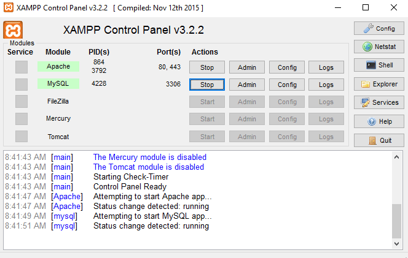
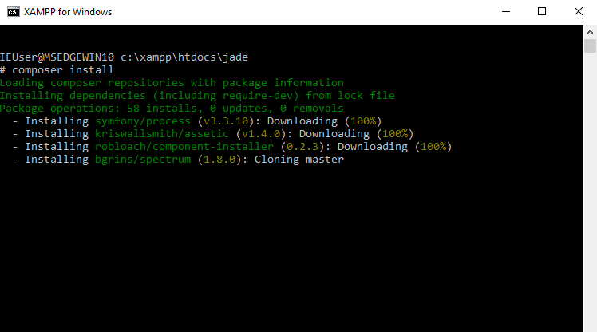

# Installation and Configuration

The steps below will walk you through installing an Apache/MySQL/PHP environment on your Windows system, then installing and configuring Jade to work in that environment. You will need administrator access to perform some of these steps.

## Windows

* Download and install [XAMPP for Windows](https://apachefriends.org). During the installation, ensure that the following components are included.

  
  
  > The steps below assume that XAMPP is installed in `C:\xampp`. If you installed XAMPP to a different location, replace the paths below accordingly.

* Once XAMPP is installed, launch the XAMPP control panel and start Apache and MySQL.

  

* Edit the `C:\xampp\php\php.ini` file and make the following changes to it:

    * Activate PHP's `intl` extension by finding the line below and removing the semi-colon from the beginning of the line so that it looks like this:

          extension=php_intl.dll
  
    * Configure the maximum size for file uploads by adjusting the `post_max` and `upload_max` variables to a value 25% higher than the maximum possible size of a file upload.
  
          post_max_size=50M
          upload_max_filesize=50M

    * Set the `file_uploads` configuration value in your `php.ini` file to `On`.

          file_uploads=On
          
    * Configure the timezone for the application logs by adjusting the `date.timezone` variable. [Find your timezone in the PHP manual](http://php.net/manual/en/timezones.php).
  
          date.timezone=IST

* Download and install [Composer](https://getcomposer.org) for Windows. Ensure that Composer is added to the system path.

    > Composer should automatically detect the PHP binary included with XAMPP and offer to use it.

* Download and install [Git](https://git-scm.com/download/win). Ensure that Git is added to the system path.

    > The steps below assume that Git is installed in `C:\Git`. If you installed Git to a different location, replace the paths below accordingly.
  
* Download the [latest stable release of Jade](https://github.com/vvaswani/jade/releases).

* Extract the contents of the release archive to the `C:\xampp\htdocs\` directory. 

* Rename the resulting `C:\xampp\htdocs\jade-x.y.z` directory to `C:\xampp\htdocs\jade`.

* From the XAMPP control panel, click the "Shell" button and start a new shell. 

* Within the XAMPP shell, execute the commands below:

      set PATH=%PATH%;"C:\Git\cmd"
      cd htdocs\jade
      composer install

  Composer should now begin downloading all the dependencies for Jade. This process will take several minutes.

  
    
* Within the same XAMPP shell, execute the commands below:

      mysql -u root -e "CREATE DATABASE jade"
      mysql -u root -e "GRANT ALL ON jade.* TO 'jade'@'localhost' IDENTIFIED BY 'password'"
  
  > Update the previous command to use a more complex password if you wish.

* Copy `C:\xampp\htdocs\jade\config\autoload\local.php.dist` to `C:\xampp\htdocs\jade\config\autoload\local.php`.

* Update the `doctrine.connections.orm_default.params` key in `C:\xampp\htdocs\jade\config\autoload\local.php` with the correct database credentials for the Doctrine ORM connection, as shown below. Update the password as needed.

      ...
      'params' => [
          'host'     => 'localhost',
          'port'     => '3306',
          'user'     => 'jade',
          'password' => 'password',
          'dbname'   => 'jade',
      ]
      ...
                
* Update the `translator.locale` key in `C:\xampp\htdocs\jade\config\autoload\local.php` with the required locale and language (defaults to `English (UK)`, other languages may require [additional translation files](LOCALIZATION.md)).

      ...
      'translator' => [
          'locale' => 'en_GB',
      ],
      ...
    
* Within the XAMPP shell, create the database tables by running the command below from the `C:\xampp\htdocs\jade` directory:

      cd htdocs\jade
      .\vendor\bin\doctrine-module orm:schema-tool:create 
      .\vendor\bin\doctrine-module orm:fixtures:load 

  
      
* Launch a new Windows command prompt as administrator.

* Change to the `C:\xampp\htdocs\jade\public\components` directory and run the following commands:

      del bootstrap
      mklink /D bootstrap ..\..\vendor\components\bootstrap
      del bootstrap-select
      mklink /D bootstrap-select ..\..\vendor\bootstrap-select\bootstrap-select
      del jquery
      mklink /D jquery ..\..\vendor\components\jquery
      del modernizr
      mklink /D modernizr ..\..\vendor\components\modernizr
      del polyfill\spectrum
      mklink /D polyfill\spectrum ..\..\..\vendor\bgrins\spectrum
      del polyfill\html5-simple-date-input-polyfill
      mklink /D polyfill\html5-simple-date-input-polyfill ..\..\..\vendor\liorwohl\html5-simple-date-input-polyfill

* Browse to `http://localhost/jade` to access the application.